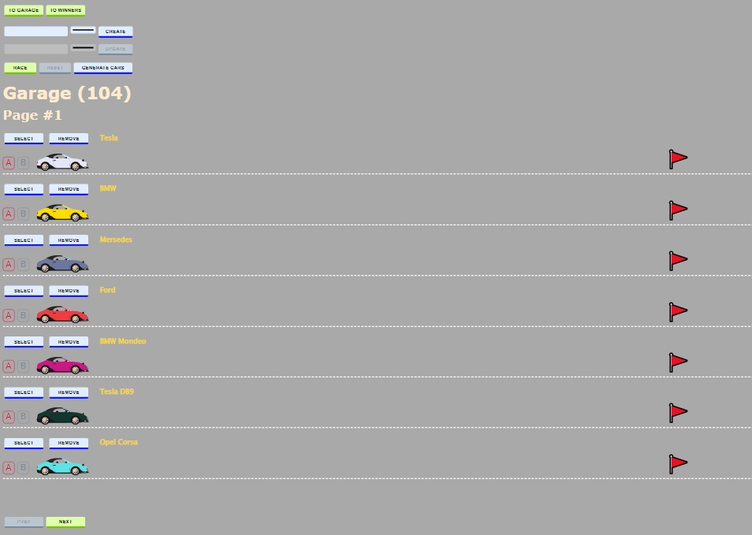

# Async Race

## Functional requirements

1. Basic structure:
   - There should be two views on the site: "Garage" and "Winners".
   - "Garage" view should contain its name, page number, and the full amount of items in the database (how many car user has in his garage).
   - "Winners" view should contain its name, page number, and the full amount of items in the database (how many records the winners table contains).
   - View state should be saved when user switches from one view to another. For example, page number shouldn't be reset, input controls should contain that they contained before switching, etc.
2. "Garage" view:
   - User should be able to create, update, delete a car, and see the list of the cars. Car has only two attributes: "name" and "color". For "delete"-operation car should be deleted from "garage" table as well as from "winners".
   - User should be able to select any color from an RGB-Palete and see the picture of the car colored with the color selected and car's name.
   - Near the car's picture should be buttons to update its attributes or delete it.
   - There should be pagination on the "Garage" view (7 cars per one page).
   - There should be a button to create random cars (100 cars per click). Name should be assembled from two random parts, for example "Tesla" + "Model S", or "Ford" + "Mustang" (At least 10 different names for each part). Color should be also generated randomly.
3. Car animation:
   - Near the car's picture should be buttons for starting / stoping the car engine.
   - User clicks to the engine start button -> UI is waiting for car's velocity answer -> animate the car and makes another request to drive. In case api returned 500 error car animation should be stopped.
   - User clicks to the engine stop button -> UI is waiting for answer for stopping engine -> car returned to it's initial place.
   - Start engine button should be disabled in case car is already in driving mode. As well as stop engine button should be disabled when car is on it's initial place.
   - Car animation should work fine on any screen (smallest screen size is 500px).
4. Race animation:
   - There should be a button to start race. After user clicks this button all the cars on the current page start driving.
   - There should be a button to reset race. After user clicks this button all the cars return to it's initial places.
   - After some car finishes first user should see the message contains car's name that shows which one has won.
5. "Winners" view:
   - After some car wins it should be displayed at the "Winners view" table.
   - There should be pagination (10 winners per one page).
   - Table should include the next culumns: "№", "Image of the car", "Name of the car", "Wins number", "Best time in seconds" (names of the columns can differ). If the same car wins more than once the number of wins should be incremented while best time should be saved only if it's better than the stored one.
   - User should be able to sort cars by wins number and by best time (ASC, DESC).

## Non-functional requirements

- Typescript must be used. Types of input and output parameters of all the methods must be described. Using type "any" is strictly forbidden.
- Application is divided to logical modules / layers. Like working with api it's separate module, as well as working with UI rendering, or working with an application state, etc. Better discuss architecture with a mentor before implementing.
- All the HTML-content is generated by JavaScript (body contains only one tag script inside).
- Application is SPA.
- Webpack or another bundler should be used. There should be one HTML-file, JS-file, and one CSS-file (or it can be embedded right in the HTML-file).
- Eslint with [Airbnb style guide](https://github.com/airbnb/javascript) should be used. Some paricular eslint-rules can be disabled or changed only after agrement with a mentor. There shouldn't be any eslint errors or warnings.
- Code divided to small functions with a clear names and purposes. Each function should be less or equal to 40 lines.
- There are not unnecessary code duplications.
- Code shouldn't contain magical numbers or strings.

## Deploy: https://kykysja-async-race.netlify.app
